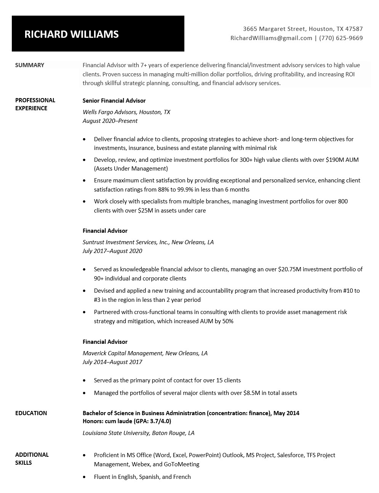
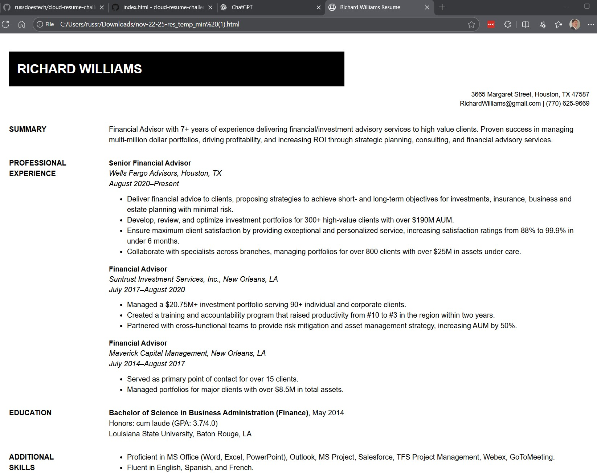
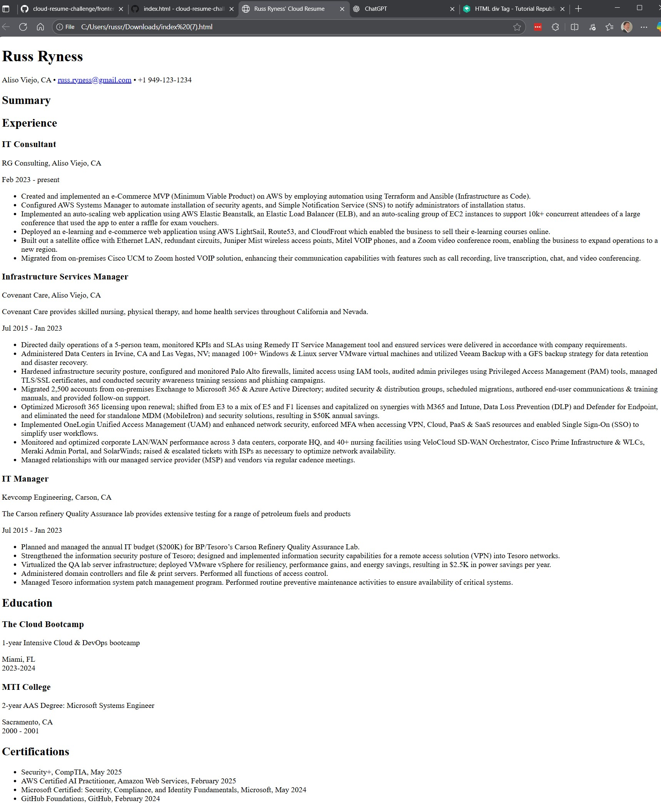

# Frontend Technical Specification

- Create a static website that serves an html resume.

## Resume format considerations

- Structured with a regionally (US) relevant layout, such as:
  
  -- Objective

  -- Experience

  -- Certifications

  -- Education

- US resumes should not contain address, photo, or hobbies/interests
- Hobbies, interests, and a photo can be presented on a related website


### Resume Template


I'm comfortable with HTML, but don't feel like generating the HTML and CSS by hand, so I'll be using AI to generate the HTML and CSS and will modify as needed.

Prompt:
```
Convert this resume format into HTML
Use the least amount of CSS tags
```
Image provided to the LLM:


This is the [generated output](./docs/nov-22-2025_resume_template_minimal.html), which I will refactor.


## Unaltered resume render

This is the render of the unaltered html template generated by ChatGPT




##HTML Adjustments

- UTF8 supports most languages. I'm only concerned with English.
- Since I want the resume to view correctly on a mobile device, I'll include the viewpoort meta tag wideth=device-width so mobile styling scales normally.
- I'll extract my styles into its own sylesheet once I'm happy with the HTML markup.


This is the render of the refactored resume, with my data filled in and the html structure refined.


## Serve the static website locally

I need to server the static website locally so I can start using css stylesheets externally from my HTML page in a Cloud Develpment Enviroment (CDE).

*** Install HTTP server
```sh
npm i http-server -g
```

### Server Website

http-server will serve a public folder by default

### Start http-server
```
> cd frontend
> http-server
```

### setup stylesheet

Created a new folder under 'assets' named 'stylesheets' and created a style.css file in the folder.

And added the following line to the end of the 'head' section: 
<link rel="stylesheet" href="/assets/stylesheets/style.css">

Added a quick background color to the style.css file and reloaded the webpage and made sure it udpated.
html, body {
    background: rgb(87, 190, 237)
}
 
Downloaded a background image, making sure the dimensions weren't too large. Then ran the image through an optimizer to reduce the file size, and finally converted it to webp which further reduced the size.

## FrontEnd Framework Considerations

- I chose to use React because it is the most popular JS framework.
- I chose to use Vite.js because my frontend will be simple.
- Configured React Router v7,e and used declarative mode.

## Destructuring Considerations

I decided to use Destructing rather than standard JavaScript object dot-notation, as I felt it fit the layout of the resumeData.js file more cleanly, and resulted in more minimal-looking references within the body of the various React files.

## Troubleshooting

I was having some issues getting the references to data within 'resumeData.js' working, which was breaking the resume page and preventing it from rendering. I utilized ChatGPT to verify the correct syntax of my JS destructuring, and corrected my import reference for resumeData, resolved the issues, and got the resume page to render correctly. (again)

I was also having an issue with the email href, where when selected, it was opening a new email in the associated email app, but was not populating the mailto address. When hovering over the link, it showing 'mailto:{email} rather than the actual email address. I again utilized ChatGPT for advice on correcting my syntax. I used the suggested 'template literals' syntax shown below, which resolved the problem.

```
<a href={`mailto:${email}`}>{email}</a> 
```

